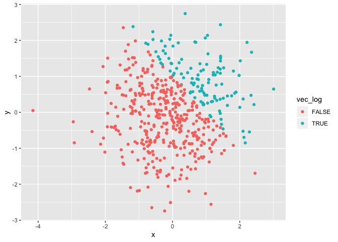
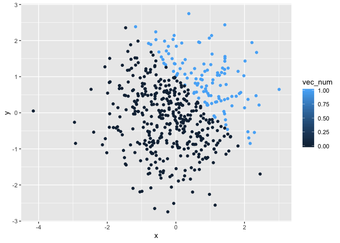
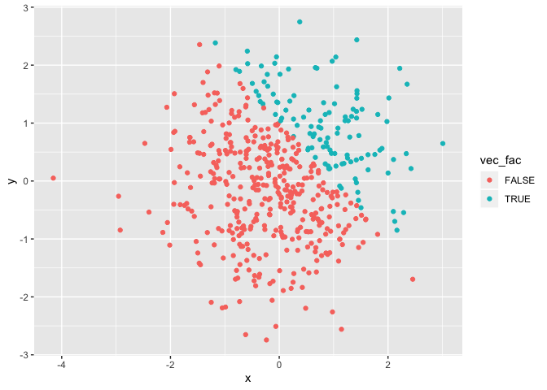

p8105\_hw1\_mp3745
================
Matthew Parker
9/13/2019

# Problem 1

``` r
# Load tidyverse library
library(tidyverse)
```

``` r
# Create first dataframe
prob1_df <- tibble(
  norm_samp = rnorm(8),
  norm_samp_pos = norm_samp > 0,
  vec_char = c("a", "b", "c", "d", "e", "f", "g", "h"),
  vec_factor = factor(c("burrito", "quesadilla", "tacos", "burrito", "burrito", "tacos", "tacos", "tacos"))
)

# See if mean can be calculated for norm_samp in prob1_df
mean(pull(prob1_df, norm_samp))
```

    ## [1] -0.5903795

``` r
# See if mean can be calculated for norm_samp_pos in prob1_df
mean(pull(prob1_df, norm_samp_pos))
```

    ## [1] 0.375

``` r
# See if mean can be calculated for vec_char in prob1_df
mean(pull(prob1_df, vec_char))
```

    ## Warning in mean.default(pull(prob1_df, vec_char)): argument is not numeric
    ## or logical: returning NA

    ## [1] NA

``` r
# See if mean can be calculated for vec_factor in prob1_df
mean(pull(prob1_df, vec_factor))
```

    ## Warning in mean.default(pull(prob1_df, vec_factor)): argument is not
    ## numeric or logical: returning NA

    ## [1] NA

The mean could be calculated for norm\_samp and norm\_samp\_pos, but not
vec\_char or vec\_factor in prob1\_df.

``` r
# Apply as.numeric to norm_samp_pos from prob1_df
as.numeric(pull(prob1_df, norm_samp_pos))

# Apply as.numeric to vec_char from prob1_df
as.numeric(pull(prob1_df, vec_char))

# Apply as.numeric to vec_factor from prob1_df
as.numeric(pull(prob1_df, vec_factor))
```

In the logical vector, all the “TRUE”s were converted into 1’s. In the
character vector, everything was converted to “NA”. In the factor
vector, the factors were converted to their numerical levels. This
explains how we were able to calculate a mean for the logical vector and
factor vector, but not the
character.

``` r
# Convert the logical vector to numeric, and multiply the random sample by the result
as.numeric(pull(prob1_df, norm_samp_pos)) * pull(prob1_df, norm_samp)
```

    ## [1] 0.1605866 0.0000000 0.0000000 0.0000000 0.1415738 0.0000000 0.0000000
    ## [8] 0.8886598

``` r
# convert the logical vector to a factor, and multiply the random sample by the result
factor(pull(prob1_df, norm_samp_pos)) * pull(prob1_df, norm_samp)
```

    ## Warning in Ops.factor(factor(pull(prob1_df, norm_samp_pos)),
    ## pull(prob1_df, : '*' not meaningful for factors

    ## [1] NA NA NA NA NA NA NA NA

``` r
# convert the logical vector to a factor and then convert the result to numeric, and multiply the 
# random sample by the result
as.numeric(factor(pull(prob1_df, norm_samp_pos))) * pull(prob1_df, norm_samp)
```

    ## [1]  0.3211731 -0.3422241 -1.8090500 -1.2031575  0.2831476 -0.2428372
    ## [7] -2.3165874  1.7773196

# Problem 2

``` r
# Create the dataframe
prob2_df <- tibble(
  x = rnorm(500),
  y = rnorm(500),
  vec_log = x + y > 1,
  vec_num = as.numeric(vec_log),
  vec_fac = factor(vec_log)
)
```

The above dataframe (prob2\_df) has 500 rows and 5 columns. The mean of
x is -9.35182810^{-4}. The median of x is 0.0190102. The standard
deviation of x is 0.9561032. In addition, the proportion of cases in
which x + y \> 1 is 0.24.

``` r
# Scatterplot of y vs x by vec_log from prob2_df
scat_plot_log <- ggplot(prob2_df, aes(x = x, y = y, color = vec_log)) +
  geom_point()

# View scatterplot
scat_plot_log
```

<!-- -->

``` r
# Scatterplot of y vs x by vec_num from prob2_df
scat_plot_num <- ggplot(prob2_df, aes(x = x, y = y, color = vec_num)) +
  geom_point()

# View scatterplot
scat_plot_num
```

<!-- -->

``` r
# The color scale in the above plot is a sliding scale from blue (vec_num = 1) to black (vec_num = 0), 
# but there are only two distinct colors because vec_num only has two values (0 and 1).

# Scatterplot of y vs x by vec_fac from prob2_df
scat_plot_fac <- ggplot(prob2_df, aes(x = x, y = y, color = vec_fac)) +
  geom_point()

# View scatterplot
scat_plot_fac
```

<!-- -->

``` r
# The color scale in the above plot is the same as when coloring by the logical vector. The factor 
# vector only has two values (True or False).

# Export the first scatterplot
ggsave("scatter_plot_log.png", plot = scat_plot_log)
```

    ## Saving 7 x 5 in image
